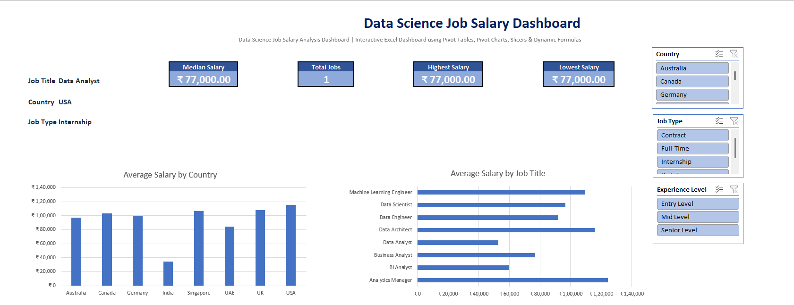
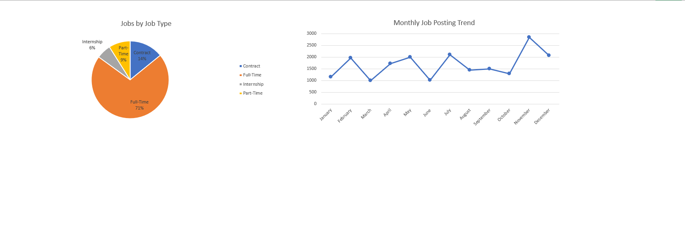

# 📊 Data Science Job Salary Analysis Dashboard

An Excel dashboard that analyzes salary trends across Data Science and Analytics job postings, built to explore how compensation varies by country, job title, job type, and experience level.



---

## 🧾 Overview

This project was created as part of my Excel learning journey to practice data analysis and dashboard development. Using Excel tables, formulas, Pivot Tables, Pivot Charts and Slicers, I built an interactive dashboard to analyze Data Science job salaries across different countries, job titles and job types. 
---

## 📂 Dataset

The dataset contains the following fields:

| Column | Description |
|---|---|
| Job ID | Unique identifier for each posting |
| Job Title | Role advertised |
| Country | Job location |
| Job Type | Full-Time, Part-Time, Contract, or Internship |
| Company | Hiring company |
| Median Salary | Salary for the posting |
| Job Posting Month | Month the job was posted |
| Experience Level | Entry, Mid, or Senior |
| Work Mode | Remote, Onsite, or Hybrid |

Data is stored as a structured Excel Table (`JobData`) so all formulas and Pivot Tables reference it dynamically instead of fixed cell ranges.

---

## 🛠️ Tools and Excel Features Used

- **Excel Tables** – structured data storage with auto-expanding ranges
- **Data Validation (Dropdown Lists)** – filter selectors for Job Title, Country, and Job Type
- **UNIQUE** – generating distinct value lists for dropdowns (Job Title, Country, Job Type, Experience Level, Work Mode) 
- **XLOOKUP** – retrieving salary values based on a selected job title
- **FILTER** – returning matching rows dynamically based on selected filters
- **Conditional Formatting (Color Scales)** – highlighting high vs. low salary values in the raw data
- **Pivot Tables** – aggregating average salary by country and job title, and counts by job type and posting month
- **Pivot Charts** – visualizing pivot table output directly
- Bar, Column, Pie, and Line Charts
- **Slicers** – connected across multiple pivot tables (Country, Job Type, Experience Level) for synchronized filtering
- **Dynamic KPI Cards** – Median Salary, Total Jobs, Highest Salary, and Lowest Salary that update automatically based on selected filters using Excel formulas.

---

## ✨ Dashboard Features

- Job Title, Country, and Job Type dropdown filters
- Four dynamic KPI cards (Median Salary, Total Jobs, Highest Salary, Lowest Salary) that update automatically based on the selected filters.
- Average Salary by Country (Column chart)
- Average Salary by Job Title (Bar chart)
- Jobs by Job Type (Pie chart)
- Monthly Job Posting Trend (Line chart)
- Slicers for Country, Job Type, and Experience Level that update all connected charts and pivot tables at once



---

## 💡 Key Insights

- The dashboard makes it easy to compare salary trends across different countries, job titles, and job types using interactive filters.
- KPI cards update dynamically based on the selected Job Title, Country, and Job Type, providing quick insights into salary statistics and total job postings.
- Pivot Charts and Slicers allow users to explore hiring trends and compare data from multiple perspectives.
- This project demonstrates practical Excel skills, including data cleaning, dynamic formulas, Pivot Tables, Pivot Charts, Slicers, and dashboard design.

---

## 📁 Project Structure

```
├── Data_Science_Job_Salary_Dashboard.xlsx   # Main workbook
│   ├── Dashboard      # Interactive dashboard (KPIs, charts, slicers, filters)
│   ├── Raw_Data       # Source data as an Excel Table
│   ├── Pivot          # Pivot tables used to build the charts
│   └── Lists          # Unique value lists powering the dropdowns
├── dashboard-overview.png
├── dashboard-charts.png
└── README.md
```
